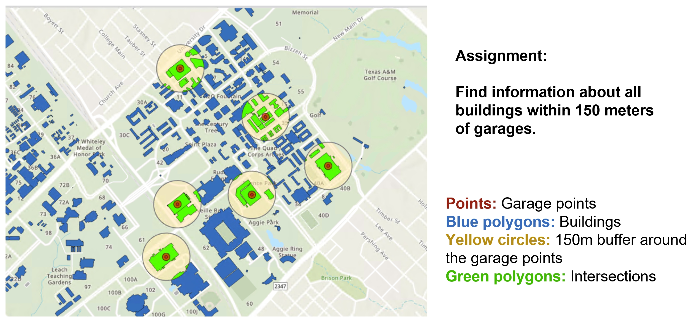

# GEOG676_GISProgramming

Lab04 – Read text file & class, objects

**Objectives:** 
**Arcpy** 
1. CreateFileGDB_management
2. MakeXYEventLayer_management
3. FeatureClassToGeodatabase_conversion
4. Copy_management
5. Project_management
6. spatial analysis
       a. Buffer_analysis
       b. Intersect_analysis
7. TableToTable_conversion

