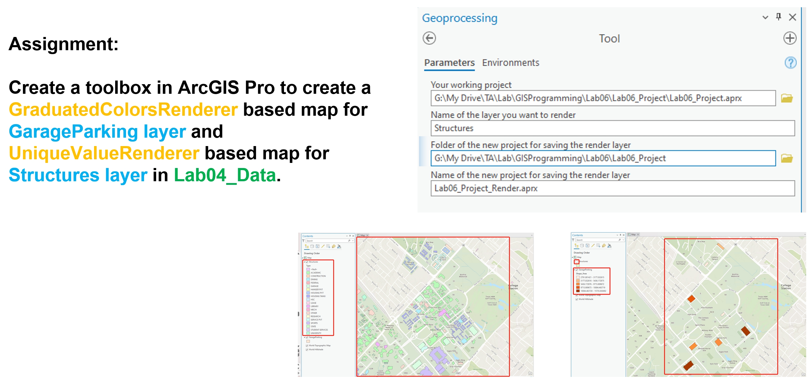

# GEOG676_GISProgramming

Lab06 – Renderer map & Toolbox message 

**Objectives:** 
1. Use arcpy to create maps including
   
   a. GraduatedColorsRenderer based map  
   b. UniqueValueRenderer based map.
2. Toolbox messages in the toolbox.

 

